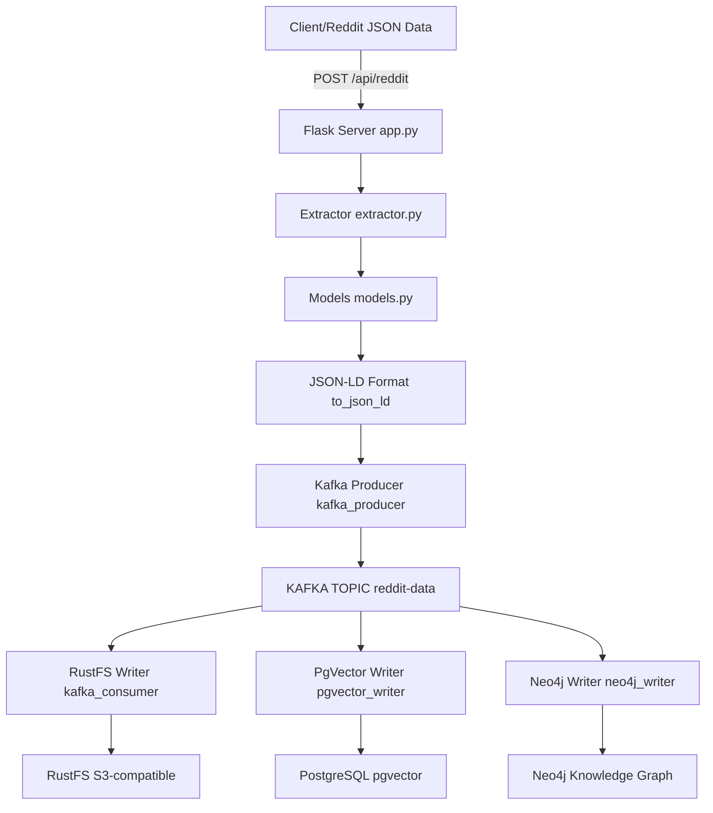

# Reddit Orchestrator - Python Implementation

This is the Python implementation of the Reddit data orchestrator. It receives Reddit JSON data, extracts posts and comments, converts the output to JSON-LD format, and sends it to a Kafka topic for processing by multiple storage backends.

## Features

- **Data Extraction**: Extracts Reddit post and comment data from JSON
- **JSON-LD Formatting**: Converts extracted data to JSON-LD format using schema.org vocabulary
- **Kafka Integration**: Sends formatted data to a Kafka topic
- **REST API**: Flask-based HTTP API for receiving Reddit data
- **Multi-Store Architecture**: Event-driven pipeline with RustFS (S3-compatible), PostgreSQL+pgvector, and Neo4j writers
- **Semantic Search**: Generates embeddings using sentence-transformers for semantic search capabilities
- **Knowledge Graph**: Builds relationships and entities in Neo4j for graph-based analysis

## Architecture

### Current Architecture (Multi-Store Event-Driven Pipeline)



### Multi-Store Architecture (Event-Driven Pipeline)

The system has been refactored to use an **event-driven pipeline pattern** with Kafka as the central message bus.

#### Storage Layers

| Writer | Purpose | Storage | Data Format |
|--------|---------|---------|-------------|
| **RustFS Writer** | Raw data archiving | RustFS (S3-compatible) | Original JSON, files, logs |
| **PgVector Writer** | Semantic search & metadata | PostgreSQL + pgvector | Structured metadata + vector embeddings |
| **Neo4j Writer** | Knowledge graph | Neo4j | Nodes (entities) + relationships |

Each writer is an independent Kafka consumer. This **decoupled architecture** provides scalability, resilience, flexibility, and parallel processing.

#### Key Features by Component

**RustFS Writer (kafka_consumer.py):**
- Writes raw Reddit posts and comments to S3-compatible storage
- Uses RustFS as the storage backend (replacing MinIO)
- Stores data in separate buckets for posts and comments
- Preserves original JSON format for archival purposes

**PgVector Writer (pgvector_writer.py):**
- Extracts text content from Reddit data
- Generates semantic embeddings using sentence-transformers
- Stores structured metadata and vector embeddings in PostgreSQL
- Enables semantic search and similarity queries
- Creates comprehensive database schema for Reddit data

**Neo4j Writer (neo4j_writer.py):**
- Identifies entities (users, posts, comments, subreddits)
- Creates relationships between entities
- Builds a knowledge graph for complex queries
- Supports graph-based analysis and traversal

---

## Setup & Running

### Prerequisites

Ensure you have these external services running:

#### 1. Kafka Cluster
- Running at your configured address (default: `192.168.1.1:9092`)
- Topic: `reddit-data` (or configure `KAFKA_TOPIC`)

#### 2. RustFS (S3-compatible storage)
- Running at `192.168.1.1:9000`
- Credentials: `rustfsadmin` / `rustfsadmin`
- Required buckets: `reddit-posts`, `reddit-comments`

**Setup:**
```bash
# Install RustFS client or use AWS CLI with S3-compatible endpoint
# Configure your S3 client to point to RustFS endpoint
```

#### 3. PostgreSQL + pgvector
- Running at `192.168.1.1:5432`
- Database: `reddit_handler`, User: `user` / `password` (or configure as needed)

**Setup:**
```sql
CREATE DATABASE reddit_handler;
\c reddit_handler
CREATE EXTENSION IF NOT EXISTS vector;
```

#### 4. Neo4j
- Running at `bolt://192.168.1.1:7687`
- Credentials: `neo4j` / `neo4j` (or configure as needed)
- Bolt protocol enabled

#### 5. Python 3.11+

---

### Installation

```bash
# Install uv
curl -LsSf https://astral-sh.github.io/uv/install.sh | sh

# Clone and setup
cd reddit_orchestrator
uv venv
source .venv/bin/activate  # Windows: .venv\Scripts\activate
uv pip install -r pyproject.toml
```

---

### Configuration

All configuration via environment variables. Create `.env` file:

```bash
# Kafka
KAFKA_BOOTSTRAP_SERVERS=192.168.1.1:9092
KAFKA_TOPIC=reddit-data
KAFKA_CLIENT_ID=reddit-handler-py
KAFKA_CONSUMER_GROUP=reddit-handler-py-consumer

# Flask Configuration
FLASK_ENV=development
FLASK_DEBUG=False

# Server Configuration
HOST=0.0.0.0
PORT=8080

# RustFS Configuration (for Kafka consumer - S3-compatible)
RUSTFS_ENDPOINT=192.168.1.1
RUSTFS_PORT=9000
RUSTFS_ACCESS_KEY=rustfsadmin
RUSTFS_SECRET_KEY=rustfsadmin
RUSTFS_SECURE=false
RUSTFS_POSTS_BUCKET=reddit-posts
RUSTFS_COMMENTS_BUCKET=reddit-comments

# MinIO Configuration (for Kafka consumer - deprecated, replaced by RustFS)
MINIO_ENDPOINT=192.168.1.1
MINIO_PORT=9000
MINIO_ACCESS_KEY=reddit_user
MINIO_SECRET_KEY=reddit_user
MINIO_SECURE=false

# PostgreSQL + pgvector Configuration (for PgVector Writer)
PG_HOST=192.168.1.1
PG_PORT=5432
PG_DATABASE=reddit_handler
PG_USER=user
PG_PASSWORD=password

# Neo4j Configuration (for Neo4j Writer)
NEO4J_URI=bolt://192.168.1.1:7687
NEO4J_USER=neo4j
NEO4J_PASSWORD=neo4j
```

---

### Running Locally

**4 components, 4 separate terminals:**

**Terminal 1 - Flask API (Producer):**
```bash
source .venv/bin/activate
python app.py
# API at http://localhost:8080
```

**Terminal 2 - RustFS Writer (S3 Storage):**
```bash
source .venv/bin/activate
python kafka_consumer.py
```

**Terminal 3 - PgVector Writer (Semantic Search):**
```bash
source .venv/bin/activate
python pgvector_writer.py
```

**Terminal 4 - Neo4j Writer (Knowledge Graph):**
```bash
source .venv/bin/activate
python neo4j_writer.py
```

Or with environment file:
```bash
source .venv/bin/activate
python app.py                    # Terminal 1 - Flask API
python kafka_consumer.py        # Terminal 2 - RustFS Writer
python pgvector_writer.py        # Terminal 3 - PgVector Writer
python neo4j_writer.py           # Terminal 4 - Neo4j Writer
```

---

### Testing the Flow

```bash
# Send test data
curl -X POST http://localhost:8080/api/reddit \
  -H "Content-Type: application/json" \
  -d @test_reddit_data.json

# Verify:
# - Flask returns HTTP 200 with extracted data
# - RustFS has new files in reddit-posts and reddit-comments buckets
# - PostgreSQL has new rows in reddit_posts, post_embeddings, and related tables
# - Neo4j has new nodes (User, Post, Comment, Subreddit) and relationships
```

---

### Using Docker

```bash
# Start all services
docker-compose up -d

# View logs
docker-compose logs -f app
docker-compose logs -f kafka-consumer
docker-compose logs -f pgvector-writer
docker-compose logs -f neo4j-writer

# Stop
docker-compose down
```

---

## API Endpoints

### POST /api/reddit
Process Reddit JSON data.

### GET /
Health and info endpoint.

### GET /health
Health check endpoint.

---

## Kafka Configuration

Messages sent to Kafka use JSON-LD format. Messages are keyed by Reddit post ID.

---

## Testing

```bash
curl -X POST http://localhost:8080/api/reddit \
  -H "Content-Type: application/json" \
  -d @test_reddit_data.json
```

---

## Troubleshooting

**uv: command not found:**
```bash
curl -LsSf https://astral-sh.github.io/uv/install.sh | sh
export PATH="$HOME/.local/bin:$PATH"
```

**Kafka connection:** Check Kafka is running and accessible.

**PostgreSQL:** Verify database and pgvector extension exist.

**Neo4j:** Verify Bolt protocol is enabled.

**RustFS:** Verify buckets exist and credentials are correct.

**sentence-transformers:** If embeddings fail, ensure the model can be downloaded and has sufficient memory.

---

## Comparison with Go Implementation

| Feature | Go | Python |
|---------|----|---------|
| HTTP Server | net/http | Flask |
| JSON Processing | encoding/json | json module |
| Data Models | Structs | Dataclasses |
| Output Format | JSON | JSON + JSON-LD |
| Data Storage | PostgreSQL | Kafka + Multi-Store |
| Deployment | Docker | Docker |

---

## License

This implementation follows the same license as the original Go implementation.
